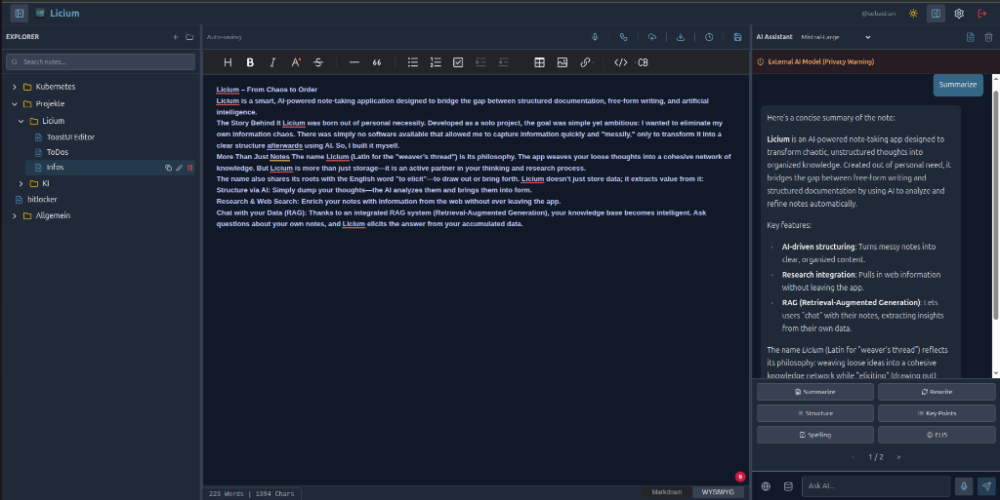
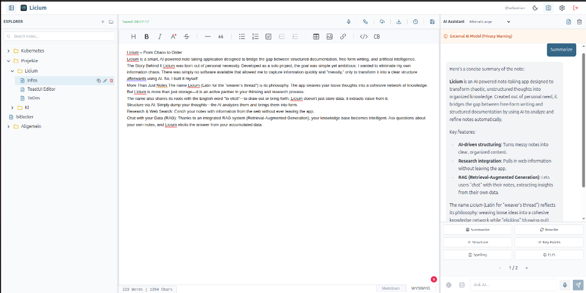

<div align="center">
  
  <h1>Licium – From Chaos to Order</h1>
</div>

Licium is a smart, AI-powered note-taking application designed to bridge the gap between structured documentation, free-form writing, and artificial intelligence.

#### The Story Behind It
Licium was born out of personal necessity. Developed as a solo project, the goal was simple yet ambitious: to eliminate personal information chaos. There was no software available that allowed capturing information quickly and "messily," only to transform it into a clear structure afterwards using AI. So, I built it myself.

#### More Than Just Notes
The name **Licium** (Latin for the "weaver's thread") embodies its philosophy: the app weaves your loose thoughts into a cohesive network of knowledge. Licium is more than just storage—it is an active partner in your thinking and research process.

The name also shares its roots with the English word *"to elicit"*—to draw out or bring forth. Licium doesn't just store data; it extracts value from it:

- **Structure via AI**: Simply dump your thoughts—the AI analyzes them and brings them into form.
- **Research & Web Search**: Enrich your notes with information from the web without ever leaving the app.
- **Chat with your Data (RAG)**: Thanks to an integrated RAG system (Retrieval-Augmented Generation), your knowledge base becomes intelligent. Ask questions about your own notes, and Licium elicits the answer from your accumulated data.

> **Project Realization**
> This project was realized using **Vibe-Coding** and **Antigravity by Google**.

---

> [!CAUTION]  
> **Development Status: Beta**  
> Licium is currently in active development. While it is stable for daily use, please be aware that bugs and unexpected behavior may occur. **Always back up your data.**  
> 
> **Editor Update**  
> Licium now utilizes the `@licium` scoped editor packages (a maintained fork of Toast UI) to ensure stability and support modern features like Tailwind dark mode integration.

---

## Features

### 🎨 Visual Showcase & Theming

Licium features a clean, professional interface with automatic **Dark Mode** support. The application respects your system preferences by default (`prefers-color-scheme`) but also allows for manual toggling via the settings.

<div align="center">
  
  
  <p><em>Seamless switch between Dark and Light mode for comfortable day and night usage.</em></p>
</div>

### 📝 Core Editor & Note Management
- **WYSIWYG Markdown Editor**: Powered by the `@licium` editor (maintained fork of Toast UI), giving you a rich editing experience while maintaining full Markdown compatibility.
- **Tree-Based Organization**: Organize your notes hierarchically with folders and files. Supports **Drag-and-Drop** functionality for intuitive restructuring and reordering.
- **Robust Persistence**: Notes are securely stored in a PostgreSQL database with a reliable saving mechanism that handles network latency and rapid switching.
- **Image Handling**: Drag & drop or paste images directly into your notes. Includes a custom context menu for resizing (Small/Medium/Large).
- **Multimedia Support**: YouTube links are automatically converted into inline, playable video widgets.
- **Plugins**: Integrated support for Charts, UML diagrams (Mermaid-style), Text Alignment, Details/Summary collapsible blocks, Emoji picker, and advanced table operations (merged cells).


### 🤖 AI Integration
- **Context-Aware Assistance**: Chat with your notes using your preferred LLM.
- **Provider Agnostic**: Supports **OpenAI** (Cloud) and **Ollama** (Local LLM) out of the box.
- **Voice Input**: Dictate prompts directly using the integrated Whisper speech-to-text.
- **Smart Actions**: Built-in quick actions to:
    - **Summarize** long texts.
    - **Rewrite** for clarity or tone.
    - **Structure** unstructured thoughts.
    - **Generate To-Dos** or Key Points.
    - **Explain Like I'm 5 (ELI5)**.
- **Web Search Integration**: Uses **SearXNG** to provide the AI with real-time web access (privacy-focused metasearch).
- **Voice Recording & Transcription**: Local, multilingual speech-to-text using **Whisper** (supports DE, EN, FR, IT, ES, NL).


### 🔐 Administration & Security
- **User Management**: Admin dashboard to manage users, reset passwords, and change roles.
- **Registration Control**: Toggle public registration on/off to control access to your instance.
- **Infrastructure Security**:
    - **Non-Root Containers**: Services run as unprivileged users (`node`, `nginx`).
    - **Strict Rate Limiting**: 5 login attempts/min to prevent brute force.
    - **Session-Only**: No client-side API tokens; strict HTTP-only cookie authentication.
- **Secure Deployment**: Built for Kubernetes with Docker, utilizing standard Ingress for secure routing and management.

---

## Tech Stack
- **Frontend**: React (Vite), Tailwind CSS, Zustand (State Management).
- **Backend**: Node.js (Express), TypeScript.
- **Database**: PostgreSQL (with `pgvector` extension).
- **Infrastructure**: Kubernetes, Docker, Traefik, SearXNG, Draw.io.

---

## Setup & Deployment

You can run Licium easily using Docker, Docker Compose, or Kubernetes.

### Option 1: Docker Compose (Recommended for Local Setup)
Using `docker-compose` is the easiest way to get the full stack (Frontend, Backend, Database) running.

> **Note**: This setup relies on internal network security and does not implement the K8s-based Basic Auth.

1.  **Start the Stack**:
    ```bash
    docker-compose up -d
    ```

2.  **Access the App**:
    - **Frontend**: http://localhost:8080
    - **Backend API**: http://localhost:3001
    - **Draw.io**: http://localhost/drawio (via Nginx proxy)
    - **SearXNG**: http://localhost/search (via Nginx proxy)

> **Important**: The setup uses `pgvector/pgvector:pg15`. For production, please update the credentials in `docker-compose.yml`.

### Option 2: Kubernetes (Production)
For a scalable production deployment, use the provided K8s manifests in `k8s/` (Template).

> **Important**: The `k8s/` folder contains generalized templates using `licium.domain.local`. Before applying, configure your ingress host and generate your own secrets.

```bash
# 1. Generate Secrets (Edit secrets-template.yaml first)
kubectl apply -f k8s/secrets.yaml

# 2. Apply Resources
kubectl apply -f k8s/
```

### Option 3: Helm Chart (Advanced)
For advanced Kubernetes deployments, use the provided Helm chart.

1.  **Install Chart**:
    ```bash
    helm install licium ./charts/licium
    ```

2.  **Customize Values**:
    Edit `charts/licium/values.yaml` to configure domains (`licium.domain.local`), enabled features (`ingressRoute`, `persistence`), and resource limits.

### Option 4: Manual Docker Run
If you prefer running individual containers:

1.  **Run Database**:
    ```bash
    docker run -d --name licium-db -e POSTGRES_PASSWORD=password pgvector/pgvector:pg15
    ```

2.  **Run Backend**:
    ```bash
    docker run -d -p 3001:3001 --name licium-server \
      --link licium-db:db \
      -e DATABASE_URL=postgres://postgres:password@db:5432/notebook \
      -e JWT_SECRET=change-me \
      -e IB_API_TOKEN=change-me \
      natorus87/licium-server:latest
    ```

3.  **Run Whisper (Optional)**:
    ```bash
    docker run -d -p 8000:8000 --name whisper \
      -e WHISPER__MODEL=deepdml/faster-whisper-large-v3-turbo-ct2 \
      -e WHISPER__COMPUTE_TYPE=int8 \
      fedirz/faster-whisper-server:latest-cpu
    ```

4.  **Run Frontend**:
    ```bash
    docker run -d -p 8080:80 --name licium-client \
      natorus87/licium-client:latest
    ```

> **Note**: Without a custom network or Nginx config, the frontend might not reach the backend API correctly in this manual mode. Docker Compose is strongly recommended.

---

## 🚀 Getting Started

Once you have deployed Licium, follow these steps to get your instance ready:

### 1. Create the Admin Account
The **first user** to register on a fresh instance is automatically granted **Admin** privileges.
1. Navigate to your Licium frontend (e.g., `http://localhost:8080`).
2. Click on **Register**.
3. Create your account. You now have full control over the instance (User Management, System Settings).

### 2. Configure AI Providers
Go to **Settings → AI Connections** to set up your preferred LLM.
- **Default Behavior**: Licium may come pre-configured to look for a local Ollama instance or OpenAI (depending on env vars).
- **Ollama (Local)**: Ensure your Ollama instance is reachable. Use `http://host.docker.internal:11434` if running in Docker containers.
- **OpenAI**: Enter your API Key if you wish to use cloud-based models.

### 3. Verify Whisper (Audio)
If you deployed the Whisper container:
- Go to **Settings → System Checks** (if available) or simply try recording an audio note.
- **Note**: The first transcription might take a few seconds longer as the model initializes.
- **Tip**: Ensure you have selected the correct input device in your browser.

---

## Acknowledgments & Credits

Licium is built on the shoulders of giants. A heartfelt thank you goes out to the incredible open-source projects and technologies that made this possible:

*   **[@google](https://github.com/google)**: For the power of **Vibe-Coding**, **Antigravity**, and **Gemini**, which transformed the development of this project.
*   **[@nhn](https://github.com/nhn) (Toast UI)**: For the excellent Markdown editor foundation.
*   **[@searxng](https://github.com/searxng)**: For enabling privacy-respecting, metasearch capabilities.
*   **[@jgraph](https://github.com/jgraph) (Draw.io / diagrams.net)**: For the powerful diagramming integration.
*   **[@postgres](https://github.com/postgres)**: For the robust database and `pgvector` extension.
*   **[@openai](https://github.com/openai)**: For the Whisper model architecture fueling our local transcription.
*   **The Open Source Community**: To all the maintainers and contributors of the libraries, frameworks, and tools used in this stack (React, Node.js, Vite, Tailwind, and many more) — thank you.
